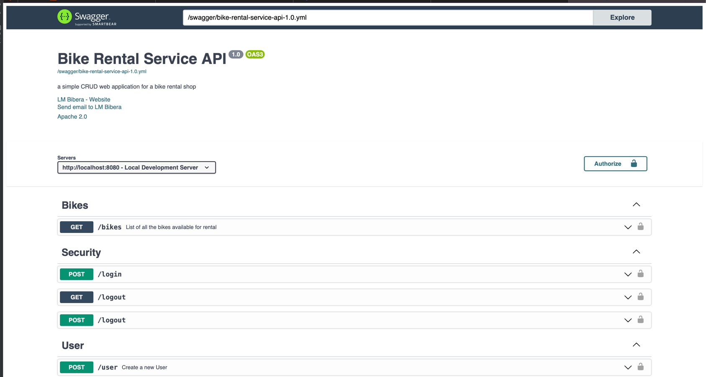
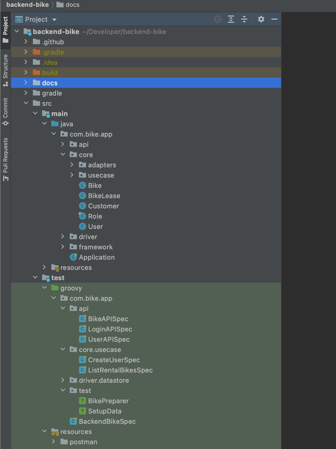
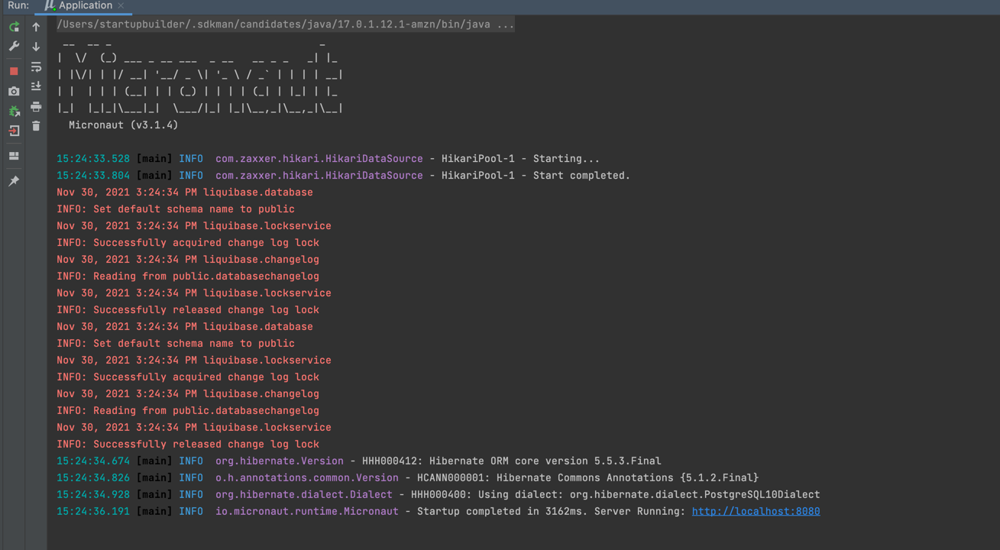
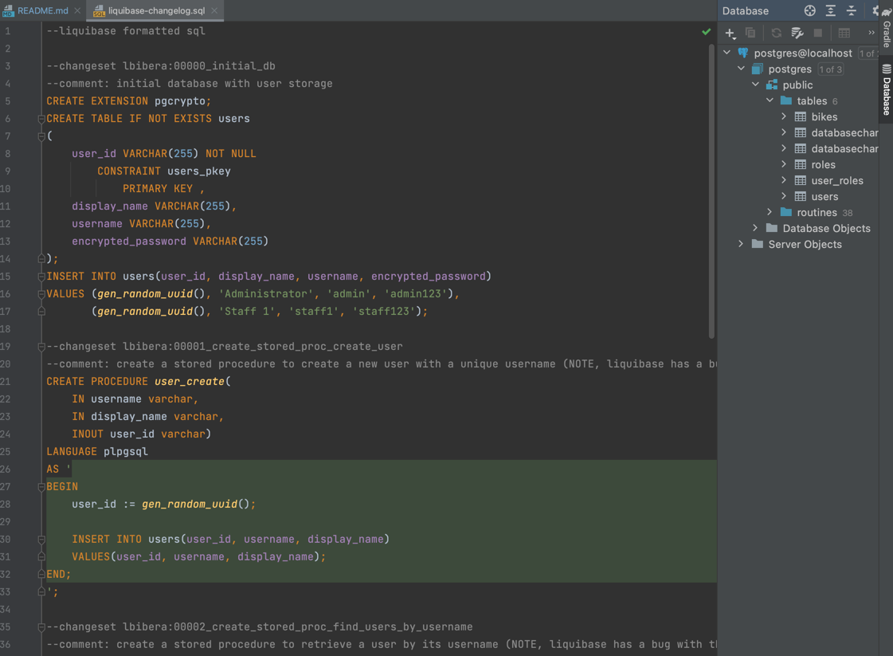
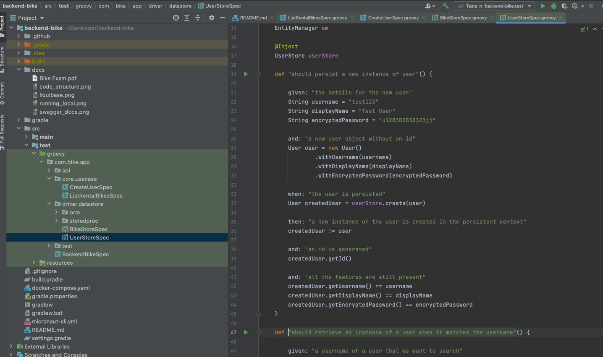
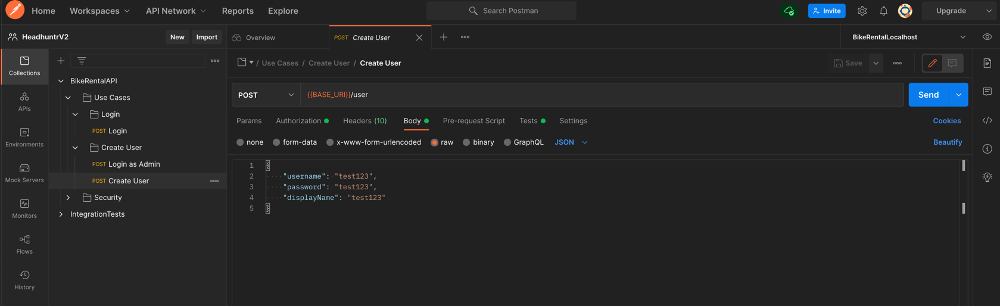
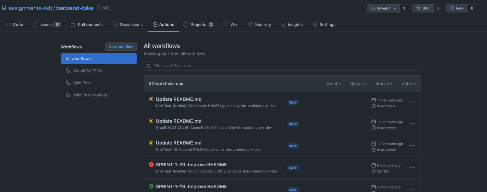

# Bike Rental API
A microservice for managing bike rentals.

Under Development: [SPRINT 1](https://github.com/assignments-tsb/backend-bike/projects/2)

[](https://github.com/assignments-tsb/backend-bike/actions/workflows/unit_test.yml)
[](https://github.com/assignments-tsb/backend-bike/actions/workflows/unit_test_native.yml)
[](https://github.com/assignments-tsb/backend-bike/actions/workflows/graalvm.yml)

## Documentation (OpenAPI)
API endpoint documentation should be auto-generated from code to reflect the most up-to-date version
http://localhost:8080/swagger-ui/


## Package Structure
- api: endpoints exposed to clients
- core: business logic (entity and use cases)
- driver: implementation of core logic dependencies
- framework: configs and framework integrations


## Running the App Locally
the application should be easily runnable on the developer's local machine
- start the postgres database
```
docker-compose up -d
```
- start the app using gradlew (or use your IDE)
```
./gradlew run
```


## Database Migration Script
Everything should be version-controlled, including the database schema
```
src/resources/db/liquibase-changelog.sql
```


## Unit Tests (Spock)


## Integration Tests (Postman)
Once we build the docker image, we should simulate running it up on a cluster via docker compose together with its dependencies, (in the case, just Postgres), and start firing up REST requests to check if the app still works.


## CI/CD
The codebase should be continually tested and deployment should be done often.
The CI practice should allow continuous checking of the codebase for the following things for every code checkin:
- static code analysis: linters, coding standards, etc (SonarQUBE)
- unit test: Spock
- code coverage: JaCoCo
- vulnerability/security scans (OWASP top 10, etc)

  Unfortunately i didnt have time to add them all in this project
